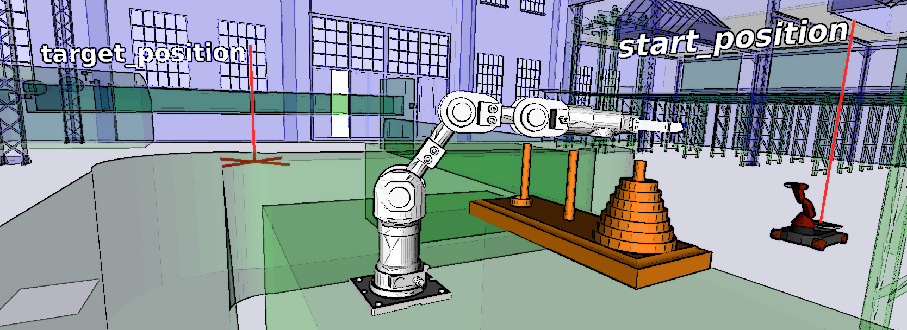
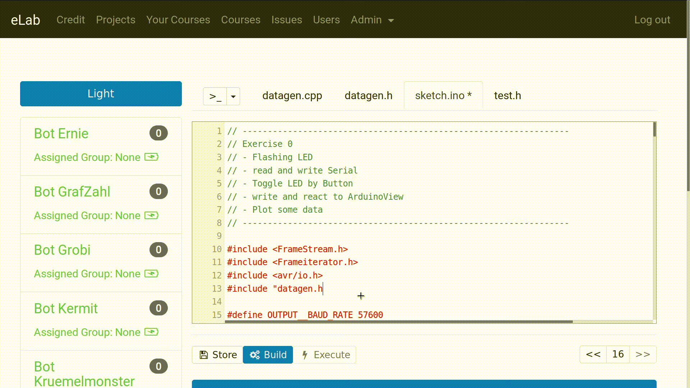

<!--
author:   André Dietrich

email:    LiaScript@web.de

version:  0.0.2

language: en

narrator: US English Male

logo:     https://tulula.sfo2.cdn.digitaloceanspaces.com/dev/images/e04ddff04767b4041fdda21a7bc463846cffa569f659cc347fa400b466f4cd83.jpeg

comment:  Presentation on LiaScript at the [elmeurope 2019](https://2019.elmeurope.org)
          conference in Paris.

@red:     <bf style= "color: red">@0</bf>

import:   https://raw.githubusercontent.com/liaTemplates/vtk/master/README.md
          https://raw.githubusercontent.com/liaTemplates/rextester/master/README.md

-->

# Open-courSe development with LiaScript

<h4> (... or Markdown on steroids, featuring Elm) </h4>


| Name    | André Dietrich                    |
| ------- | --------------------------------- |
| Project | __ https://LiaScript.github.io __ |
| eMail   | andre.dietrich@ovgu.de            |
| GitHub  | https://github.com/andre-dietrich |
| Twitter | @an_dietrich                      |


      --{{0}}--
Hi there and welcome to my talk about LiaScript, an Open-courSe authoring tool
for open educational content, which is based on a some simple Markdown
extension. When I started this project, I shortly realized that there is a huge
gap between people that want to create educational content and those who can. It
takes years to become a sophisticated web-developer, but it also takes years to
become fluent in veterinary ophthalmology, cuneiform writing or Slavic
literature. But if it comes to creating and sharing open educational content,
those people are mostly stuck at Word, PDFs, PowerPoint.


      --{{1}}--
With LiaScript I tried to create a very simple and easy to learn and to adapt
approach for developing online courses. There is no login no server required and
everything happens within the browser. The entire course is hosted on GitHub and
everything that is required is actually a link to the Markdown-document. That is
the second link is a bit longer than the first one.

       {{1}}
*******************************************************************************

https://github.com/andre-dietrich/elmeurope-2019


https://liascript.github.io/course/?https://raw.githubusercontent.com/andre-dietrich/elmeurope-2019/master/README.md

*******************************************************************************

      --{{2}}--
But probably it would be better if the system could introduce itself at the next
section.

## What is LiaScript
<!--
narrator: US English Female
-->

      --{{0}}--
Hi, my name is Lia. LiaScript is not intended to be the next Markup language. It
is more or less a tool for creating interactive screencast-like online courses.
With an easy to read and write syntax.

       {{0-1}}
```
      --{{0}}--
Hi my name is Lia. LiaScript is not intended
to be the next Markup  language.  It is more
or  less  a  tool  for  creating interactive
screencast-like online courses. With an easy
to read and write syntax.
```

      --{{1}}--
You can use for example the double braces notation as bullet-points, to indicate
when something should appear or disappear.

       {{1-2}}
```
      --{{1}}--
You can use for example the double braces
notation as bullet-points, to indicate when
something should appear or disappear.

       {{2-3}}
              Example of an ASCII-Art diagram
    1.9 |
        |                 ***
      y |               *     *
      - | r r r r r r r*r r r r*r r r r r r r
      a |             *         *
      x |            *           *
      i | B B B B B * B B B B B B * B B B B B
      s |         *                 *
        | *  * *                       * *  *
     -1 +------------------------------------
        0              x-axis               1
```


       {{2-3}}
              Example of an ASCII-Art diagram
    1.9 |
        |                 ***
      y |               *     *
      - | r r r r r r r*r r r r*r r r r r r r
      a |             *         *
      x |            *           *
      i | B B B B B * B B B B B B * B B B B B
      s |         *                 *
        | *  * *                       * *  *
     -1 +------------------------------------
        0              x-axis               1


      --{{3}}--
You can apply this technique on any kind of Markdown block, but inlining is also
possible.

```
      --{{3}}--
You  can apply  this technique on  any kind of
Markdown block, but inlining is also possible.

        {{3}}
| This   | table                    | will  |
| :----- | :----------------------- | :---- |
| appear | at the {4}{__watch me__} | end   |
```

        {{3}}
| This   | table                    | will  |
| :----- | :----------------------- | :---- |
| appear | at the {4}{__watch me__} | end   |


      --{{5 French Female}}--
And by using double dashes, you can mark a paragraph as a comment that should be
read out loud.

```
      --{{5 French Female}}--
And by using double dashes, you can mark a
paragraph as a comment that should be read
out loud.
```

## Prehistory

      --{{0}}--
But let me first start, with a little prehistory and how I started to become a
web-developer.

### SelectScript

<!--width="100%"-->

      --{{0}}--
Originally I was a robotics and embedded systems developer, who become obsessed
with programming paradigms and how people try to solve problems or think
differently in different  languages. I even tried to develop my own programming
language that contained everything I liked in other programming languages or
stuff that I missed. But my problem though was, that I could not convince anyone
in the robotics community.

> ... a declarative dynamic typed language for simulations and IoT, with
> _ternary logic_, _SQL & spatial-temporal reasoning_, _prototypes_,
> _temporal variables_, etc...
>
> __GitHub:__ https://github.com/andre-dietrich/SelectScriptC
>
> __Publications:__
>
> * Reasoning in complex environments with the _SelectScript_ declarative language
>   * URL: https://arxiv.org/abs/1508.04159
>   * YouTube: https://youtu.be/EFRV0JSdK3M
>
> * _SelectScript_: A query language for robotic world models and simulations
>   * URL: https://ieeexplore.ieee.org/abstract/document/7140077
>   * YouTube: https://youtu.be/R_PThP0gwOc


### Industrial eLab Project (BMBF)

      --{{0}}--
So when I thought my university carrier was over, a friend of mine approached to
me and asked me if I would like to join a project, called “Industrial eLab”. It
was about teaching student embedded systems programming remotely on real Arduino
robots remotely. And I was like, PHP — so we meet again old friend.

       {{0-1}}
<!--
style="width: 70%;
       display: block;
       margin-left: auto;
       margin-right: auto;" -->

      --{{1}}--
But then after some research, I stumbled across this great projects elixir and
phoenix, which is incredible. Event with only little web-development experience
I could develop a system with user Management, an online editor and remote
compiler for Arduino.

       {{1-2}}
<!--
style="width: 70%;
       display: block;
       margin-left: auto;
       margin-right: auto;" -->

      --{{2}}--
But, every time that I tried to experiment a little with the system or integrate
a new feature, the system crashed. And mostly not because of Elixir, but because
of JavaScript. The more the system grew, the more intimidating it was to update
something.

        {{2}}
<!--
style="width: 70%;
       display: block;
       margin-left: auto;
       margin-right: auto;" -->

      --{{3}}--
So I did a little research and stumbled across this language called elm. Looks
like Haskell, no runtime exceptions, statically typed, etc., that was not so
interesting as the model-view-controller approach, with only one global state.
This was genius, and so I thought lets give it a try. After rebuilding the UI
with elm I realized that the system that I had developed so far, could also be
used to teach programming, operating system, algorithms, IOT and other stuff,
but how would I develop such content and deliver it to students, via PDFs, Word,
or develop a website for every aspect? So the next idea that came into my mind,
why not using something like Markdown for creating online courses, but this time
I will add everything that I miss in Markdown to make it more interactive.

## Let's build a Markdown-interpreter with Elm

{{0}} Search for Markdown parsers in Elm: _only JavaScript_

      --{{0}}--
Let's build a Markdown interpreter in elm. Search for Markdown parsers written
in elm and extend them. Oh, there is one, but it is using JavaScript in the
back.


{{1}} Search for Parser libraries in Elm: ___Parser-Combinators???___

      --{{1}}--
Ok, so here must be some parser libraries, that I can use. Well, it seems there
are, but what the heck is a parser combinator?


{{2}} AntLR and compile it to: No Elm! But JavaScript.

      --{{2}}--
I know AntLR and I know it can be used in many languages, so probably it does
also have an elm integration. Well, no, only JavaScript.


{{3}} What else: _Regular Expressions_

      --{{3}}--
Okay, I do not want to develop an entire programming language, so it should be
sufficient to use regular expression and some basic rules, right?

{{4}} Go back to: __step 1__

      --{{4}}--
After few hours later I was wondering, what was this parser combinator thing
again.


### Modularization (Elm)

      --{{0}}--
Developing a parser the functional style actually fits into the common elm
developing process perfectly. In most cases you start with an initial app.

       {{0-1}}
<!-- style="width: calc(100vh);" -->
`````````
.
├── App.elm
├── Lia.elm
└── LiaHelper.elm
`````````

      --{{1}}--
And the more your application grows, the more you start to separate parts into
modules with a model, view, update, and some helper functions, but the same can
be done for the parser too.


       {{1-2}}
<!-- style="width: calc(100vh * 0.8)" -->
`````````
.
├── App.elm
└── Lia
    ├── Model.elm
    ├── Parser.elm
    ├── Types.elm
    ├── Update.elm
    └── View.elm
`````````

      --{{2}}--
At the end, a parser is also a composition of many parsers, such as your view
is. And every parser is only responsible for a very tiny part, such as the quiz
and survey parser only have to perform one single task.

        {{2}}
<!-- style="width: calc(100vh * 0.5)" -->
`````````
.
├── App.elm
├── Lia
│   ├── ...
│   ├── Markdown
│   │   ├── ...
│   │   ├── Quiz
│   │   │   ├── Json.elm
│   │   │   ├── Model.elm
│   │   │   ├── Parser.elm
│   │   │   ├── Types.elm
│   │   │   ├── Update.elm
│   │   │   └── View.elm
│   │   ├── Survey
│   │   │   ├── Json.elm
│   │   │   ├── Model.elm
│   │   │   ├── Parser.elm
│   │   │   └── ..
│   │   └── ...
│   └── ...
└── ...
`````````

## LiaScript vs. LMS

      --{{0}}--
For the next part, I also did a little research and tried to analyze how
difficult it is to create online courses with common Learning Management
Systems, so called LMS. I therefor watched a couple of instructional YouTube
videos and counted clicks, the time for a task, how often the page had to be
changed and also what instructors said, whether it is quite easy or complicated.
The data and links can be found at the following link.

       {{0-1}}
> _From Hero to Zero with Learning Management Systems._
>
> https://osf.io/3rweg/

{{1}} **Multimedia**

      --{{1}}--
On average, it takes 3 minutes to integrate something like video with too many
clicks and page changes. In most cases users also had to deal with the embed
code and thus leave their standard editor and switch to coding.

        {{1}}
| System | time-on-task | # of clicks | # of pages | satisfaction |
|--------|-------------:|------------:|-----------:|-------------:|
| Canvas |        02:56 |        10.4 |        5.1 |         0.83 |
| Edmodo |        02:33 |         9.1 |        2.9 |         0.00 |
| ILIAS  |        02:59 |        11.2 |        5.3 |         0.00 |
| Moodle |        03:51 |        13.9 |        7.3 |         0.27 |


{{2}} **Quizzes**

      --{{2}}--
Quizzes are even more complicated, even for the instructors, one woman even said
“what the f” during a recording, since her settings got lost a couple of times.

        {{2}}
| System | time-on-task | # of clicks | # of pages | satisfaction |
|--------|-------------:|------------:|-----------:|-------------:|
| Canvas |        08:34 |        51.2 |       15.6 |         0.38 |
| Edmodo |        05:59 |        24.9 |        8.2 |        -0.10 |
| ILIAS  |        04:04 |        19.3 |        7.7 |         0.10 |
| Moodle |        08:33 |        47.5 |        9.9 |        -0.92 |

      --{{3}}--
Thus, the next part is intended to show, how easy these tasks can be solved with
a simple extension to Markdown.

### __Task:__ Integrating Multimedia Content

      --{{0}}--
If you know Markdown, then the first three types of links should be familiar to
you. A simple link, you can give it a name, if you put it into parentheses and
add some content in brackets at the beginning. And if you want to define an
image, you have to mark it with an exclamation mark in front of it. But that is
where Markdown ends.

``` md
https://www.youtube.com/watch?v=8pTEmbeENF4

 [a link](https://www.youtube.com/watch?v=8pTEmbeENF4)

 

 ?[sound](https://soundcloud.com/roddyricch/start-wit-me-feat-gunna)

!?[video](https://www.youtube.com/watch?v=8pTEmbeENF4)

```

      --{{1}}--
In LiaScript you can add a question mark in front of it, to indicate a sound
file. With a bit of imagination this might resemble and ear. But next to
ordinary files, this works for example also for SoundCloud.

        {{1}}
?[sound](https://soundcloud.com/roddyricch/start-wit-me-feat-gunna)

      --{{2}}--
And if you have an image with sound, then this can be interpreted as a video.
And the best thing about this is, if you are reading this document with a
Markdown reader of your choice, than these links are still valid Markdown links.

        {{2}}
!?[video](https://www.youtube.com/watch?v=8pTEmbeENF4)<!--
width="600" height="400"
-->

### __Task:__ Adding Quizzes

[( )] This is wrong.
[(X)] The only correct option.
[( )] Still not right.


[[ ]] Add as many elements as you want?
[[X]] The X marks the correct answer!
[[ ]] ... this is wrong ...
[[X]] ... this has to be selected too ...
[[?]] hint1
[[?]] __ hint 2__
*********************************

solution

$$
   \sum_{i=1}^\infty\frac{1}{n^2}
        =\frac{\pi^2}{6}
$$

********************************


## Lazy Parsing & Refactoring

        {{0}}
<!-- style="width: 80%" -->
`````````
   Document: String                         Model
 ╔══════════════════════╗                 +---------------------+
 ║ # main title         ║                 | title: List String  |
 ║                      ║                 +---------------------+
 ║ ## sub-title         ║                 | body: List Markdown |
 ║                      ║  (JiT compile)  +---------------------+
 ║ ``` python           ║ --------------> | code: Array Code    |
 ║ print("Hello World") ║                 +---------------------+
 ║ ```                  ║                 | quiz: Array Quiz    |
 ║                      ║                 +---------------------+
 ║ ...                  ║                 | ...                 |
 ╚══════════════════════╝                 +---------------------+
`````````
        {{1}}
<!-- style="width: 80%;" -->
`````````
           |
    (Preprocessing)
           |
           v

   Model: Array Slides
 +--------------------+--------------------+--------------------
 | title: main title  | title: sub-title   | title: ...
 | code:  String      | code:  String      | ...
 +--------------------+--------------------+--------------------
`````````
        {{2}}
<!-- style="width: 80%" -->
`````````
           |                                          |
     (JiT compile)                              (JiT compile)
           |                                          |
           v                                          v
 +--------------------+                     - - - - - - - - - - -
 | body: Markdown     |
 +--------------------+
 | code: Vector Code  |
 +--------------------+
 | quiz: Vector Quiz  |
 +--------------------+
 | ...                |
`````````

## Hello World

```javascript
var s = "Hello World";
alert(s);
s + 22;
```
<script>@input</script>


### Projects

``` js     -EvalScript.js
let who = data.first_name + " " + data.last_name;

if(data.online) {
  who + " is online"; }
else {
  who + " is NOT online"; }
```
``` json    +Data.json
{
  "first_name" :  "Sammy",
  "last_name"  :  "Shark",
  "online"     :  true
}
```
<script>
  // insert the JSON dataset into the local variable data
  let data = @input(1);

  // eval the script that uses this dataset
  eval(`@input(0)`);
</script>

## Macros

@red(See a List of Templates at:) https://github.com/LiaTemplates

``` markdown
<!--
author: ...

@red:    <bf style= "color: red">@0</bf>

@multiline_macro
<script>
  ... @0 ... @1 ... @input(1)
</script>
@end

import:   https://raw.githubusercontent.com/liaTemplates/vtk/master/README.md
          https://raw.githubusercontent.com/liaTemplates/rextester/master/README.md

attribute: _Say thank you_

-->

# Macros

@red(See a List of Templates at:) https://github.com/LiaTemplates

```


        {{1}}
``` c Rextester.c
#include<stdio.h>

int main(void) {
  printf("Hello World\n");
  return 0;
}
```
@Rextester.C


### No Brain

> This might take a while until the patient data is loaded.
>
> `@VTK.load(https://data.kitware.com/api/v1/file/58e665158d777f16d095fc2e/download)`

@VTK.load(https://data.kitware.com/api/v1/file/58e665158d777f16d095fc2e/download)


## What's Next?


       {{0-1}}
> _Infographic: Textbook Costs Skyrocket 812% in 35 Years_
>
> [[www.aeseducation.com](https://www.aeseducation.com/blog/infographic-the-skyrocketing-cost-of-textbooks-for-schools-students)]
>
> _The cost of getting a (decent) education in India is skyrocketing_
>
> [[qz.com](https://qz.com/india/445500/the-cost-of-getting-a-decent-education-in-india-is-now-staggering/)]
>
> _College Textbook Prices Increasing Faster Than Tuition And Inflation_
>
> [[huffpost.com](https://www.huffpost.com/entry/college-textbook-prices-increase_n_2409153)]


        {{1}}
*********************************************************************

__Atom:__

* liascript-preview: https://atom.io/packages/liascript-preview
* liascript-snippets: https://atom.io/packages/liascript-snippets

*********************************************************************

        {{2}}
*********************************************************************

__Projects:__

* http://github.com/LiaTemplates
* http://github.com/LiaBooks

*********************************************************************

## Misc

### Messaging (Elm)

        {{0}}
``` elm
type alias Event = { topic : String, section : Int , message : JE.Value }

update : Msg -> Model -> ( Model, Cmd Msg, Maybe Event )
...
```

        {{1}}
``````````
  [MODULES]                       ┏━━━━━━━━━━┓      ░  [MESSAGES]
 -----------                      ┃ Terminal ┃      ░ ------------                   { ... }
                                  ┗━━━━━┳━━━━┛      ░                                 =====
                              ┏━━━━━━━━━┛           ░                                   |
      ┌─┬─┬─┬───        ┌─┬─┲━┻━┱───                ░                                   v
 Quiz │0│1│2│...   Code │0│1┃ 2 ┃...                ░      { top: "term", sec: ., msg: ... }
      └┬┴┬┴┬┴───        └┬┴┬┺━┳━┹───                ░       ===============================
       └ ┴ ┼ ─ ─ ─       └ ┴ ─┠ ─ ─ ─               ░                                   |
           └ ─ ─ ─ ─ ─ ─ ─┲━━━┛                     ░                                   |
 ┌──────────┐         ┌─┲━┻━┱─┬─────                ░                                   v
 │ Settings │  Slides │0┃ 1 ┃2│ ...                 ░      { top: "code", sec: 2, msg: ... }
 └─────┬────┘         └┬┺━┳━┹┬┴─────                ░       ===============================
       │               └─ ╂ ─┴ ─ ─ ─                ░                                   |
       │            ┏━━━━━┛                         ░                                   |
 ┏━━━━━┷━━━━━━━━━━━━┻━━━━━━━┓                       ░                                   v
 ┃         LiaScript        ┃                       ░     { top: "slide", sec: 1, msg: ... }
 ┗━━━━━━━━━━━━━━━━━━━━━━━━━━┛                       ░
         |         ^                                ░
         v  ports  |                                ░
``````````


### Lifting a Project and Dependencies to Elm 0.19

{{1}} ** Remain on Elm 0.18!!! **

{{2}} Update your project first --> webcomponents, ports, operators, lazy, etc.

{{3}} Update the libraries --> operators, lazy, etc.

{{4}} Upgrade your libraries to Elm 0.19

{{5}} Upgrade your project to Elm 0.19
