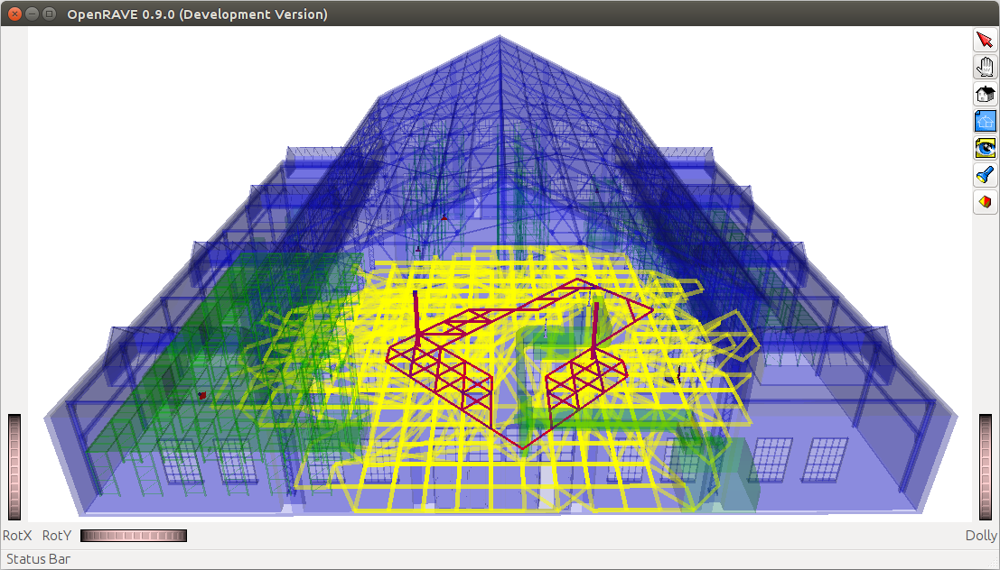

<!--
author:   André Dietrich

email:    andre.dietrich@ovgu.de

version:  0.0.1

language: en

narrator: US English Male

comment:  Presentation on LiaScript at the elmeurope 2019 conference in Paris.

@red:    <bf style= "color: red">@0</bf>

link:     https://cdnjs.cloudflare.com/ajax/libs/animate.css/3.7.0/animate.min.css

import:   https://raw.githubusercontent.com/liaTemplates/vtk/master/README.md
          https://raw.githubusercontent.com/liaTemplates/rextester/master/README.md

-->


# Open-courSe development with LiaScript

<h4> (... or Markdown on steroids, featuring Elm) </h4>


| Name    | André Dietrich                    |
| ------- | --------------------------------- |
| Project | __ https://LiaScript.github.io __ |
| eMail   | andre.dietrich@ovgu.de            |
| GitHub  | https://github.com/andre-dietrich |
| Twitter | @an_dietrich                      |


                               {{1}}
*******************************************************************************

https://github.com/andre-dietrich/elmeurope-2019


https://liascript.github.io/course/?https://raw.githubusercontent.com/andre-dietrich/elmeurope-2019/master/README.md

*******************************************************************************

## Learning Management Systems (LMS)

<!-- class="animated fadeIn" -->
                                    {{1-3}}
__Task:__ Integrating multimedia content

<!-- class="animated fadeIn" -->
                                    {{2-3}}
| System | time-on-task | # of clicks | # of pages | satisfaction |
|--------|-------------:|------------:|-----------:|-------------:|
| Canvas |        02:56 |        10.4 |        5.1 |         0.83 |
| Edmodo |        02:33 |         9.1 |        2.9 |         0.00 |
| ILIAS  |        02:59 |        11.2 |        5.3 |         0.00 |
| Moodle |        03:51 |        13.9 |        7.3 |         0.27 |


<!-- class="animated fadeIn" -->
                                     {{3}}
__Task:__ Adding quizzes

<!-- class="animated fadeIn" -->
                                     {{4}}
| System | time-on-task | # of clicks | # of pages | satisfaction |
|--------|-------------:|------------:|-----------:|-------------:|
| Canvas |        08:34 |        51.2 |       15.6 |         0.38 |
| Edmodo |        05:59 |        24.9 |        8.2 |        -0.10 |
| ILIAS  |        04:04 |        19.3 |        7.7 |         0.10 |
| Moodle |        08:33 |        47.5 |        9.9 |        -0.92 |


## Todo: Multimedia

__Bret Victor The Future of Programming:__

https://www.youtube.com/watch?v=8pTEmbeENF4

<!-- width="600" height="400" -->

## Todo: Quizzes

__How would you implement a quiz in Markdown?__


[( )] This is wrong.
[(X)] The only correct option.
[( )] Still not right.


[[ ]] Add as many elements as you want?
[[X]] The X marks the correct answer!
[[ ]] ... this is wrong ...
[[X]] ... this has to be selected too ...
[[X]] ... this has to be selected too ...
[[?]] hint1
[[?]] hint2

[[liascript]]
************************************

blablabla


$$
   \sum_{i=1}^\infty\frac{1}{n^2}
        =\frac{\pi^2}{6}
$$

************************************


# Prehistory: SelectScript

<!-- class="animated fadeIn" -->
          {{0}}
<!--width="100%"-->


<!-- class="animated fadeIn" -->
          {{1}}
```Python     Ternary Logic
True   AND  None  ==  None
False  AND  None  ==  False
None   AND  None  ==  None
```


<!-- class="animated fadeIn" -->
          {{2}}
```Python     Lazy Evaluation
OR(False, True, ..., function(...), ...)
          ^^^^
```


<!-- class="animated fadeIn" -->
           {{3}}
```SQL     Temporal variables
-- store position and id for 5 seconds
measure{5.0} = SELECT id($robot), position($robot)
                 FROM $sensor = (SELECT *
                                   FROM hall
                                  WHERE isSensor($this)),
                      $robot  = (SELECT *
                                   FROM hall
                                  WHERE isRobot($this))
                WHERE isSensing($sensor, $robot)
                   AS dictionary;
```


<!-- class="animated fadeIn" -->
          {{4}}
```SQL     Solving the Towers of Hanoi
tower  = [[3,2,1], [], []];   -- initial tower configuration
finish = [[], [], [3,2,1]];   -- goal configuration
-- allowed moves [from, to]
moves = [[0,1], [0,2], [1,0], [1,2], [2,0], [2,1]];

    SELECT $m
      FROM m:moves
     WHERE finish == mov($tower, $m[0], $m[1])
-- recursive part --
START WITH $tower = tower
CONNECT BY $tower@mov($m[0], $m[1])
 STOP WITH $tower == None OR $step$ > 6
-- recursive end --
        AS list;

-- result: [[[0,2],[0,1],[2,1],[0,2],[1,0],[1,2],[0,2]]]
```

<!-- class="animated fadeIn" -->
           {{5}}
<!--width="100%"-->


## Industrial eLab Project (BMBF)

<!-- class="animated fadeIn" -->
    {{1-2}}
<!--
style="width: 70%;
       display: block;
       margin-left: auto;
       margin-right: auto;" -->


<!-- class="animated fadeIn" -->
    {{2-3}}
<!--
style="width: 70%;
       display: block;
       margin-left: auto;
       margin-right: auto;" -->


<!-- class="animated fadeIn" -->
    {{3-4}}
<!--
style="width: 70%;
       display: block;
       margin-left: auto;
       margin-right: auto;" -->


# Let's build a Markdown-interpreter with Elm


    {{1}}
<!-- class="animated fadeIn"-->
* Search for Markdown parsers in Elm: _only JavaScript_


    {{2}}
<!-- class="animated fadeIn" -->
* Search for Parser libraries in Elm: ___Parser-Combinators???___


    {{3}}
<!-- class="animated fadeIn" -->
* AntLR and compile it to: No Elm! But JavaScript.


    {{4}}
<!-- class="animated fadeIn" -->
* What else: _Regular Expressions_


    {{5}}
<!-- class="animated fadeIn" -->
* Go back to: __step 2__


## Modularization (Elm)


    {{0-1}}
<!--
style="width:  calc(100vh);"
class="animated fadeIn"
-->
`````````
.
├── App.elm
├── Lia.elm
└── LiaHelper.elm
`````````


    {{1-2}}
<!--
style="width:  calc(100vh * 0.8);"
class="animated fadeIn"
-->
`````````
.
├── App.elm
└── Lia
    ├── Model.elm
    ├── Parser.elm
    ├── Types.elm
    ├── Update.elm
    └── View.elm
`````````


     {{2}}
<!--
style="width:  calc(100vh * 0.5);"
class="animated fadeIn"
-->
`````````
.
├── App.elm
├── Lia
│   ├── ...
│   ├── Markdown
│   │   ├── ...
│   │   ├── Quiz
│   │   │   ├── Json.elm
│   │   │   ├── Model.elm
│   │   │   ├── Parser.elm
│   │   │   ├── Types.elm
│   │   │   ├── Update.elm
│   │   │   └── View.elm
│   │   ├── Survey
│   │   │   ├── Json.elm
│   │   │   ├── Model.elm
│   │   │   ├── Parser.elm
│   │   │   └── ..
│   │   └── ...
│   └── ...
└── ...
`````````


## Lazy Parsing (Elm)

    {{0}}
<!-- style="width: 80%" class="animated fadeIn" -->
`````````
   Document: String                         Model
 ╔══════════════════════╗                 +---------------------+
 ║ # main title         ║                 | title: List String  |
 ║                      ║                 +---------------------+
 ║ ## sub-title         ║                 | body: List Markdown |
 ║                      ║  (JiT compile)  +---------------------+
 ║ ``` python           ║ --------------> | code: Array Code    |
 ║ print("Hello World") ║                 +---------------------+
 ║ ```                  ║                 | quiz: Array Quiz    |
 ║                      ║                 +---------------------+
 ║ ...                  ║                 | ...                 |
 ╚══════════════════════╝                 +---------------------+
`````````
                          {{1}}
<!-- style="width: 80%;" class="animated fadeIn" -->
`````````
           |
    (Preprocessing)
           |
           v

   Model: Array Slides
 +--------------------+--------------------+--------------------
 | title: main title  | title: sub-title   | title: ...
 | code:  String      | code:  String      | ...
 +--------------------+--------------------+--------------------
`````````
                          {{2}}
<!-- style="width: 80%;" class="animated fadeIn" -->
`````````
           |                                          |
     (JiT compile)                              (JiT compile)
           |                                          |
           v                                          v
 +--------------------+                     - - - - - - - - - - -
 | body: Markdown     |
 +--------------------+
 | code: Vector Code  |
 +--------------------+
 | quiz: Vector Quiz  |
 +--------------------+
 | ...                |
`````````

## Code & JavaScript (LiaScript)

### Hello World

```javascript
var s = "Hello World";
alert(s);
s + 22;
```
<script>@input</script>


### Hello Project

``` js     -EvalScript.js
let who = data.first_name + " " + data.last_name;

if(data.online) {
  who + " is online"; }
else {
  who + " is NOT online"; }
```
``` json    +Data.json
{
  "first_name" :  "Sammy",
  "last_name"  :  "Shark",
  "online"     :  true
}
```
<script>
  // insert the JSON dataset into the local variable data
  let data = @input(1);

  // eval the script that uses this dataset
  eval(`@input(0)`);
</script>

### Hello C

``` c
#include<stdio.h>

int main(void) {
  printf("Hello World\n");
  return 0;
}
```
@Rextester.C

### Hello Brain

> This might take a while until the patient data is loaded.

<script>
    var vtkColorTransferFunction = vtk.Rendering.Core.vtkColorTransferFunction;
    var vtkFullScreenRenderWindow = vtk.Rendering.Misc.vtkFullScreenRenderWindow;
    var vtkHttpDataSetReader = vtk.IO.Core.vtkHttpDataSetReader;
    var vtkPiecewiseFunction = vtk.Common.DataModel.vtkPiecewiseFunction;
    var vtkVolume = vtk.Rendering.Core.vtkVolume;
    var vtkVolumeMapper = vtk.Rendering.Core.vtkVolumeMapper;

    var view = document.getElementById("vtk_@0");
    view.innerHTML = "";
    var fullScreenRenderer = vtk.Rendering.Misc.vtkFullScreenRenderWindow.newInstance({
        rootContainer: view,
        containerStyle: {
            height: '100%',
            overflow: 'hidden'
        },
        background: [0, 0, 0]
    });

    const renderer = fullScreenRenderer.getRenderer();
    const renderWindow = fullScreenRenderer.getRenderWindow();

    const reader = vtkHttpDataSetReader.newInstance();

    const actor = vtkVolume.newInstance();
    const mapper = vtkVolumeMapper.newInstance();
    mapper.setSampleDistance(0.7);
    actor.setMapper(mapper);

    const ctfun = vtkColorTransferFunction.newInstance();
    ctfun.addRGBPoint(200.0, 0.4, 0.2, 0.0);
    ctfun.addRGBPoint(2000.0, 1.0, 1.0, 1.0);
    const ofun = vtkPiecewiseFunction.newInstance();
    ofun.addPoint(200.0, 0.0);
    ofun.addPoint(1200.0, 0.5);
    ofun.addPoint(3000.0, 0.8);
    actor.getProperty().setRGBTransferFunction(0, ctfun);
    actor.getProperty().setScalarOpacity(0, ofun);
    actor.getProperty().setScalarOpacityUnitDistance(0, 4.5);
    actor.getProperty().setInterpolationTypeToLinear();
    actor.getProperty().setUseGradientOpacity(0, true);
    actor.getProperty().setGradientOpacityMinimumValue(0, 15);
    actor.getProperty().setGradientOpacityMinimumOpacity(0, 0.0);
    actor.getProperty().setGradientOpacityMaximumValue(0, 100);
    actor.getProperty().setGradientOpacityMaximumOpacity(0, 1.0);
    actor.getProperty().setShade(true);
    actor.getProperty().setAmbient(0.2);
    actor.getProperty().setDiffuse(0.7);
    actor.getProperty().setSpecular(0.3);
    actor.getProperty().setSpecularPower(8.0);

    mapper.setInputConnection(reader.getOutputPort());

    reader
      .setUrl(
        'https://data.kitware.com/api/v1/file/58e665158d777f16d095fc2e/download',
        { fullPath: true, compression: 'zip', loadData: true }
      )
      .then(() => {
        renderer.addVolume(actor);
        renderer.resetCamera();
        renderer.getActiveCamera().zoom(1.5);
        renderer.getActiveCamera().elevation(70);
        renderer.updateLightsGeometryToFollowCamera();
        renderWindow.render();
      });

</script>

<div id="vtk_@0" style="height: 500px"></div>

## Messaging (Elm)

    {{0}}
<!-- class="animated fadeIn" -->
``` elm
type alias Event = { topic : String, section : Int , message : JE.Value }

update : Msg -> Model -> ( Model, Cmd Msg, Maybe Event )
...
```

    {{1}}
<!-- class="animated fadeIn" -->
``````````
  [MODULES]                       ┏━━━━━━━━━━┓      ░  [MESSAGES]
 -----------                      ┃ Terminal ┃      ░ ------------                   { ... }
                                  ┗━━━━━┳━━━━┛      ░                                 =====
                              ┏━━━━━━━━━┛           ░                                   |
      ┌─┬─┬─┬───        ┌─┬─┲━┻━┱───                ░                                   v
 Quiz │0│1│2│...   Code │0│1┃ 2 ┃...                ░      { top: "term", sec: ., msg: ... }
      └┬┴┬┴┬┴───        └┬┴┬┺━┳━┹───                ░       ===============================
       └ ┴ ┼ ─ ─ ─       └ ┴ ─┠ ─ ─ ─               ░                                   |
           └ ─ ─ ─ ─ ─ ─ ─┲━━━┛                     ░                                   |
 ┌──────────┐         ┌─┲━┻━┱─┬─────                ░                                   v
 │ Settings │  Slides │0┃ 1 ┃2│ ...                 ░      { top: "code", sec: 2, msg: ... }
 └─────┬────┘         └┬┺━┳━┹┬┴─────                ░       ===============================
       │               └─ ╂ ─┴ ─ ─ ─                ░                                   |
       │            ┏━━━━━┛                         ░                                   |
 ┏━━━━━┷━━━━━━━━━━━━┻━━━━━━━┓                       ░                                   v
 ┃         LiaScript        ┃                       ░     { top: "slide", sec: 1, msg: ... }
 ┗━━━━━━━━━━━━━━━━━━━━━━━━━━┛                       ░
         |         ^                                ░
         v  ports  |                                ░
``````````


## Animations and Speech (LiaScript)

                --{{1}}--
Braces within minuses indicate that this is some explanation for a certain point ...

                  {{1}}
| This   | table                                | will  |
| :----- | :----------------------------------- | :---- |
| appear | at {3}{__inline is also possible__ } | first |


                --{{2 French Female}}--
You can set up a default voice, change it per slide or per comment.


{{2-4}} This block will appear afterwards and
disappear at step number 4.

https://liascript.github.io/course/?https://raw.githubusercontent.com/andre-dietrich/elmeurope-2019/master/README.md#16

                  {{4}}
$$
   \sum_{i=1}^\infty\frac{1}{n^2}
        =\frac{\pi^2}{6}
$$


## Packaging (Elm/LiaScript)

``` markdown
<!--
author: ...

link:    https://some_css_resource
script:  https://some_javascript_resource


@red:    <bf style= "color: red">@0</bf>

@multiline_macro
<script>
  ... @0 ... @1 ... @input(1)
</script>
@end


import:  https://some_raw_liascript_code
-->

# main title

@red(this is important)
```

@red(List of Templates:) https://github.com/LiaTemplates


## Lifting a Project and Dependencies to Elm 0.19

1. Remain on Elm 0.18
2. Update your project first
3. Update the libraries
4. Upgrade your libraries to Elm 0.19
5. Upgrade your project


## THX

http://github.com/LiaBooks
